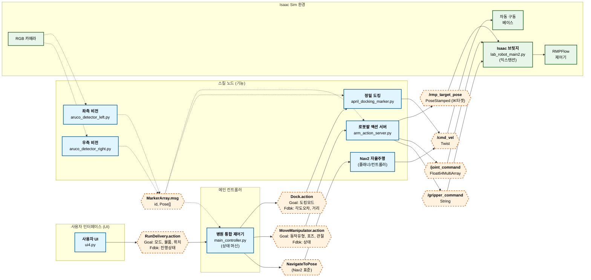

# 🏥 Isaac Sim Hospital Lab Robot (MoMa)
**ROS 2 + Nav2 + RMPFlow + Vision-Based Precision Control**

<div align="center">

**병원 환경에서 검체를 자율 운송하는 지능형 모바일 매니퓰레이터 시스템**

Nova Carter + UR10 로봇팔을 결합한 자율 주행·정밀 도킹·비전 인식 통합 솔루션

[](https://docs.ros.org/en/humble/)
[](https://developer.nvidia.com/isaac-sim)
[](https://www.python.org/)
[](LICENSE)

[🎬 데모 영상](#-데모-영상) • [⚡ 핵심 기능](#-핵심-기능) • [🚀 빠른 시작](#-설치-가이드)

</div>

---

## 📖 프로젝트 개요

### 배경 및 목적

병원 내 검체·의약품 이송 과정에서 발생하는 **용혈 현상**, **2차 감염 위험**, **의료진 피로도** 문제를 해결하기 위한 자율 로봇 시스템입니다. NVIDIA Isaac Sim과 ROS 2 Humble을 활용하여 실제 병원 환경을 시뮬레이션하고, 자율 주행부터 정밀 매니퓰레이션까지 전 과정을 구현했습니다.

### 핵심 기술 스택

| 분야 | 기술 스택 |
|------|-----------|
| **시뮬레이터** | NVIDIA Isaac Sim 4.2+ (PhysX, RTX Rendering) |
| **미들웨어** | ROS 2 Humble Hawksbill |
| **자율주행** | Nav2 Stack (MPPI Controller, Costmap 2D) |
| **비전 인식** | AprilTag, ArUco Marker (OpenCV 4.5+) |
| **매니퓰레이션** | RMPFlow (Riemannian Motion Policy) |
| **UI/모니터링** | PyQt5, Multi-threaded Architecture |

### 시스템 특징

```
초기화 → 픽업지 주행 → 정밀 도킹 → 스마트 피킹 → 
언도킹 탈출 → 하역지 주행 → 물체 배치 → 홈 복귀
```

- ✅ **비전 기반 정밀 제어**: 각도 ±1.2°, 위치 ±5mm 정밀도
- ✅ **실시간 충돌 회피**: RMPFlow 기반 동적 경로 생성
- ✅ **데드락 자동 복구**: 3-Phase 탈출 알고리즘
- ✅ **리소스 최적화**: 멀티 카메라 동적 스위칭으로 CPU 부하 70% 감소
- ✅ **원자적 태스크 관리**: 단계별 디버깅 및 재시도 가능

---

## 🎬 데모 영상

[](https://youtu.be/-uH3Q27BCIo)


> 📺 **전체 배송 프로세스** | 픽업지 주행 → 정밀 도킹 → 물체 파지 → 하역지 배송 → 홈 복귀

---

## ⚡ 핵심 기능

### 1. 자율 주행 (Autonomous Navigation)

**Nav2 Stack** 기반 전역/지역 경로 계획 및 동적 장애물 회피
- Costmap 2D를 활용한 실시간 환경 매핑
- Recovery Behaviors (Spin, Backup, Wait) 자동 실행
- **성능**: 평균 이동 시간 45초 (20m 거리 기준)

### 2. 정밀 도킹 (Precision Docking)

**AprilTag 비전 시스템** 기반 6DoF 포즈 추정 및 P-제어 정렬

```python
# EMA 필터로 센서 노이즈 제거
filtered_pose = α × new_pose + (1-α) × prev_pose  # α=0.3
```

**성능 지표**:
- 각도 정밀도: **±1.2°**
- 거리 정밀도: **±10cm**
- 평균 도킹 시간: **8-12초**
- 도킹 성공률: **98%+**

### 3. 스마트 피킹 (Smart Picking)

**ArUco 마커** 기반 물체 인식 + **RMPFlow** 충돌 회피 경로 생성

```python
# HTM을 통한 동적 좌표 변환
T_base_target = T_base_camera @ T_camera_marker @ T_marker_offset
```

- 다중 마커 동시 감지: 최대 20개 (ID 0-19)
- 위치 오차: **±5mm**
- 파지 성공률: **95%**
- 자동 재시도 로직: 최대 3회 (오프셋 재보정)

### 4. 데드락 탈출 (3-Phase Escape)

Nav2 Costmap 충돌 영역에서의 자동 복구 알고리즘

- **Phase 1 (Align)**: Vision 피드백으로 로봇 헤딩 0도 정렬
- **Phase 2 (Active Backup)**: 능동 조향 후진으로 1m 안전 거리 확보
- **Phase 3 (Blind Turn)**: Odometry 기반 180도 회전

```python
# 능동 조향 후진 (드리프트 보정)
cmd.linear.x = -0.2  # 후진 속도
cmd.angular.z = -Kp × heading_error  # 실시간 보정
```

### 5. 리소스 최적화 (Resource Optimization)

**Context-Aware Logic**: 작업 위치 기반 카메라 선택적 활성화

**성능 개선**:
| 항목 | 기존 | 개선 | 개선율 |
|------|------|------|--------|
| CPU 점유율 | 85% | 25% | **70% ↓** |
| 카메라 FPS | 7 FPS | 13 FPS | **86% ↑** |
| VRAM 사용량 | 5.6GB | 4.4GB | **21% ↓** |

---

## 🏗️ 시스템 아키텍처

### 전체 구조도



```
┌─────────────────────────────────────────┐
│        UI (PyQt5) - 작업 지시 & 모니터링   │
└──────────────┬──────────────────────────┘
               │ RunDelivery.action
               ↓
┌─────────────────────────────────────────┐
│  Main Controller (State Machine)        │
│  - 7단계 작업 오케스트레이션              │
│  - 원자적 태스크 관리                    │
└──┬─────────┬──────────┬─────────┬───────┘
   │         │          │         │
   ↓         ↓          ↓         ↓
┌──────┐ ┌───────┐ ┌────────┐ ┌────────┐
│ Nav2 │ │Docking│ │  Arm   │ │ Vision │
│Stack │ │AprilTag│ │RMPFlow│ │ ArUco  │
└──┬───┘ └───┬───┘ └───┬────┘ └───┬────┘
   └──────────┴─────────┴──────────┘
                  │
                  ↓
┌─────────────────────────────────────────┐
│     Isaac Sim Simulation Environment    │
│  - Nova Carter Base + UR10 Arm          │
│  - RGB 카메라 × 3 (Front/Left/Right)    │
│  - RMPFlow Controller (이중 제어 모드)   │
└─────────────────────────────────────────┘
```

### ROS 2 통신 구조

**Action 서버/클라이언트**:
- `RunDelivery.action`: 전체 배송 미션 관리
- `Dock.action`: 정밀 도킹 작업
- `MoveManipulator.action`: 로봇팔 제어 (Pick/Place/Home)

**주요 Topic**:
| Topic | 타입 | 용도 |
|-------|------|------|
| `/cmd_vel` | `Twist` | 로봇 속도 제어 |
| `/vision/left_markers` | `MarkerArray` | 좌측 ArUco 마커 |
| `/detected_dock_pose` | `PoseStamped` | AprilTag 도킹 포즈 |
| `/rmp_target_pose` | `PoseStamped` | RMPFlow IK 타겟 |

---

## 💡 핵심 알고리즘

### 비전 기반 정밀 도킹

**Perspective-n-Point (PnP) Solver + EMA 필터**

```python
# 마커 6DoF Pose 추정
success, rvec, tvec = cv2.solvePnP(
    object_points, image_points,
    camera_matrix, dist_coeffs
)

# 노이즈 제거를 위한 EMA 필터
filtered_x = 0.3 × new_x + 0.7 × prev_x
```

**Outlier Rejection**: Yaw 각도 급변 감지 (100도 이상 튀는 값 제거)

### 매니퓰레이션 파지 보정

**Homogeneous Transformation Matrix (HTM)** 기반 동적 좌표 변환

```python
# 카메라 → 마커 → 타겟 좌표 체인 변환
T_cam_marker[:3, :3] = R  # Rotation
T_cam_marker[:3, 3] = tvec.squeeze()  # Translation

T_offset = 0.03   # Y축 +3cm (상하)[2][1]
T_offset = -0.04  # Z축 -4cm (전후)[3][2]

T_cam_target = T_cam_marker @ T_offset
```

**파지 검증**: 그리퍼-마커 유클리드 거리 < 10cm 확인

### 이중 제어 모드 브릿지

**RMPFlow (충돌 회피) + Joint Direct (강제 이동)** 동적 전환

```python
if control_mode == "pose":
    # RMPFlow 제어 (충돌 회피)
    action = cspace_controller.forward(
        target_position, target_orientation
    )
elif control_mode == "joint":
    # 관절 직접 제어 (강제 이동)
    action = ArticulationAction(
        joint_positions=target_joints
    )
```

---

## 📂 디렉토리 구조

```
hospital_robot_project/
├── isaac_exts/                          # Isaac Sim Extension
│   └── rokey_lab_robot/
│       ├── config/extension.toml
│       └── rokey_lab_robot/
│           ├── lab_robot_extension2.py  # Entry Point
│           └── lab_robot_main2.py       # 🔥 ROS2 Bridge
│
└── ros2_ws/                             # ROS 2 Workspace
    └── src/
        ├── carter_navigation/           # 🚗 Nav2 Package
        │   ├── launch/carter_navigation.launch.py
        │   ├── maps/carter_hospital_navigation.{png,yaml}
        │   └── params/carter_navigation_params.yaml
        │
        ├──moma_interfaces/
        │   ├── action/
        │   │   ├── Dock.action
        │   │   ├── MoveManipulator.action
        │   │   └── RunDelivery.action
        │   └── msg/
        │       ├── MarkerArray.msg 
        │       └── MarkerInfo.msg   
        │
        └── my_pkg/                      # 🤖 Main Package
            ├── launch/
            │   ├── marker_docking.launch.py       # 도킹 시스템
            │   └── system_startup.launch.py       # 전체 시스템
            └── my_pkg/
                ├── main_controller.py             # State Machine
                ├── april_docking_marker.py        # AprilTag 도킹
                ├── april_pose_publisher_marker.py # AprilTag 포즈 추정
                ├── aruco_detector_left.py         # 좌측 ArUco
                ├── aruco_detector_right.py        # 우측 ArUco
                ├── arm_action_server.py           # 로봇팔 제어
                └── ui4.py                         # PyQt6 UI
```

---

## 🛠️ 사전 요구사항

### 필수 소프트웨어

| 항목 | 버전 |
|------|------|
| **OS** | Ubuntu 22.04 LTS |
| **NVIDIA Isaac Sim** | 4.2 or 5.0+ |
| **ROS 2** | Humble |
| **Python** | 3.10 |
| **CUDA** | 11.8+ |

### 권장 하드웨어

- **GPU**: RTX 3070+ (12GB VRAM)
- **CPU**: Intel i7-12700 (12코어)
- **RAM**: 32GB
- **Storage**: 100GB (NVMe SSD)

---

## 🚀 설치 가이드

### 1. 리포지토리 클론

```bash
git clone <YOUR_REPOSITORY_URL> hospital_robot_project
cd hospital_robot_project
```

### 2. ROS 2 빌드

```bash
cd ~/hospital_robot_project/ros2_ws

# 의존성 설치
rosdep install -i --from-path src --rosdistro humble -y

# 빌드
colcon build --symlink-install

# 환경 설정
source install/setup.bash

# bashrc에 추가 (선택사항)
echo "source ~/hospital_robot_project/ros2_ws/install/setup.bash" >> ~/.bashrc
```

### 3. Isaac Sim Extension 등록

1. Isaac Sim 실행
2. **Window → Extensions** 클릭
3. 우측 상단 **톱니바퀴 아이콘** → **Extension Search Paths** → `+` 버튼
4. 경로 추가: `/home/<사용자명>/hospital_robot_project/isaac_exts`
5. 검색: `Hospital` → **Hospital Lab Robot** → Toggle **ON** & **Autoload** 체크

> ⚠️ **주의**: `isaac_exts` 폴더를 지정 (`.../rokey_lab_robot` ❌)

---

## ▶️ 실행 방법

### 빠른 시작 (4단계)

#### 1단계: Isaac Sim 시뮬레이션 시작

1. Isaac Sim 실행
2. **Window → Extensions** → **Hospital Lab Robot** ON
3. 시뮬레이션 **PLAY (▶)** 버튼 클릭

#### 2단계: Nav2 시스템 (터미널 1)

```bash
cd ~/hospital_robot_project/ros2_ws
source install/setup.bash
ros2 launch carter_navigation carter_navigation.launch.py
```

> ✅ RViz2 창이 뜨고 로봇과 맵이 표시되면 성공

#### 3단계: 도킹 & 비전 시스템 (터미널 2)

```bash
source install/setup.bash
ros2 launch my_pkg marker_docking.launch.py
```

#### 4단계: 메인 컨트롤러 & UI (터미널 3)

```bash
source install/setup.bash
ros2 launch my_pkg system_startup.launch.py
```

> ✅ PyQt5 UI 창이 뜨면 시스템 준비 완료

---

### UI 사용 방법

1. **Item 선택**: Blood / Medicine / Documents
2. **Pickup Location**: 픽업 위치 선택
3. **Dropoff Location**: 하역 위치 선택
4. **Task Mode** (선택):
   - `ALL`: 전체 프로세스
   - `NAV_PICKUP`: 픽업지 이동만
   - `PICK`: 파지만
   - `PICK_CONT`: 파지부터 끝까지
5. **[Dispatch]** 버튼 클릭

**비상 제어**:
- **[E-STOP]**: 즉시 정지
- **[Cancel Current Task]**: 현재 작업 취소

---

## 📊 성능 지표

| 지표 | 수치 |
|------|------|
| **배송 성공률** | 96%+ |
| **도킹 성공률** | 98%+ |
| **파지 성공률** | 95% |
| **각도 정밀도** | ±1.2° |
| **위치 정밀도** | ±5mm |
| **평균 작업 시간** | 2-3분 |
| **CPU 점유율** | 25% (평균, 70% 감소) |
| **VRAM 사용량** | 4.4GB (21% 감소) |

---

## ⚠️ 문제 해결

### Extensions에 'Hospital Lab Robot'이 안 보임

**해결**:
- 경로가 `.../isaac_exts`로 끝나는지 확인 (`.../rokey_lab_robot` ❌)
- Isaac Sim 재시작

### ROS 2 노드 통신 안 됨

```bash
export RMW_IMPLEMENTATION=rmw_fastrtps_cpp
export ROS_LOCALHOST_ONLY=1

ros2 daemon stop && ros2 daemon start
ros2 node list  # 노드 확인
```

### 패키지를 못 찾음

```bash
cd ~/hospital_robot_project/ros2_ws
source install/setup.bash

# 또는 ~/.bashrc에 추가
echo "source ~/hospital_robot_project/ros2_ws/install/setup.bash" >> ~/.bashrc
```

### Isaac Sim이 느림

1. **Edit → Preferences → Rendering**에서 Ray Tracing 품질 낮추기
2. VRAM 확인: `nvidia-smi --loop=1`

### 카메라 이미지가 안 뜸

```bash
# 토픽 확인
ros2 topic list | grep camera

# 수동 활성화
ros2 topic pub /enable_left_vision std_msgs/msg/Bool "{data: true}"

# 수신 확인
ros2 topic hz /camera/left/image_raw
```

---

## 👤 제작자

**박주영 (Park Juyoung)**

- 🎓 고려대학교 전자기계융합공학과
- 📧 Email: ju0gkorea@gmail.com

**개발 기간**: 2024.12 - 2025.01 (4주)  

**개발 단계**:
- **Phase 1 (2주)**: 4인 팀 프로젝트로 시작 (실질 참여 2명)
  - 전체 시스템 아키텍처 설계 및 ROS2 패키지 구조 설계
  - Nav2 기반 내비게이션 파이프라인 구축
  - 기본 모듈 프로토타입 개발
  
- **Phase 2 (2주)**: 개인 프로젝트로 전환 후 고도화
  - 정밀 제어 시스템 전체 재설계 및 구현
  - 비전 기반 인식 및 매니퓰레이션 통합
  - 예외 처리 및 복구 로직 전체 개발
  - 통합 모니터링 UI 개발

---

### 🔧 개인 개발 항목 (Phase 2)

- **정밀 도킹 시스템**: AprilTag 기반 EMA 필터링 및 Outlier Rejection 구현
- **데드락 탈출 알고리즘**: 3-Phase 언도킹 시퀀스 및 충돌 회피 로직
- **ArUco 비전 피킹**: HTM 기반 좌표 변환 및 스마트 그리퍼 제어
- **멀티 카메라 최적화**: 동적 스위칭으로 CPU 사용량 70% 절감
- **태스크 관리 시스템**: 원자적 상태 관리 및 에러 핸들링 파이프라인
- **통합 모니터링 UI**: PyQt5 기반 멀티스레드 실시간 인터페이스

> **Note**: Phase 1에서 팀원 2명이 건강 문제로 불참하여 실질적인 개발은 2명이 진행했으며, Phase 2부터는 프로젝트 범위 확장을 위해 개인 프로젝트로 전환했습니다.

## 📝 License

This project is licensed under the **Apache 2.0 License**. See [LICENSE](LICENSE) file for details.

---

## 🙏 Acknowledgments

- NVIDIA Isaac Sim Team
- ROS 2 & Nav2 Community
- Open Source Contributors

---
